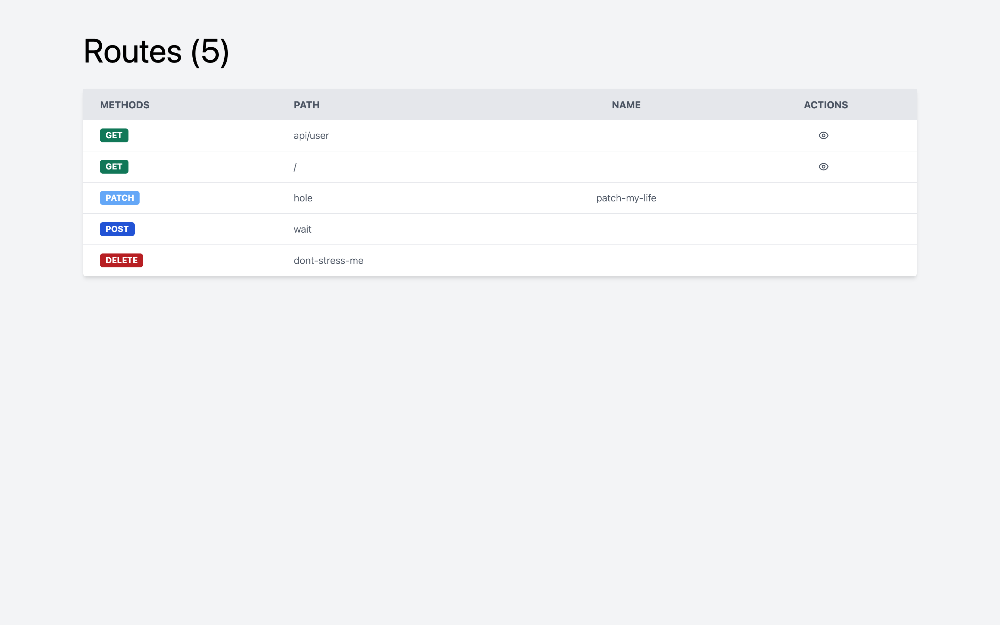

Pretty Routes for Laravel
====

Visualise your routes in pretty format.
This is the Tailwind CSS version of https://github.com/garygreen/pretty-routes



# Installation

```bash
composer require humaneguy/rootz
```

If your using autodiscovery in Laravel, it should just work.

Otherwise - add to your `config/app.php` providers array to where all your package providers are (before your app's providers):

```php
Rootz\ServiceProvider::class,
```

By default the package exposes a `/routes` url. If you wish to configure this, publish the config.

```bash
php artisan vendor:publish --provider="Rootz\ServiceProvider"
```

If accessing `/routes` isn't working, ensure that you've included the provider within the same area as all your package providers (before all your app's providers) to ensure it takes priority.

By default pretty routes only enables itself when `APP_DEBUG` env is true. You can configure this on the published config as above, or add any custom middlewares.

# Inspiration
Thanks goes to [@garygreen](https://github.com/garygreen) that created [Pretty Routes](https://github.com/garygreen/pretty-routes)
